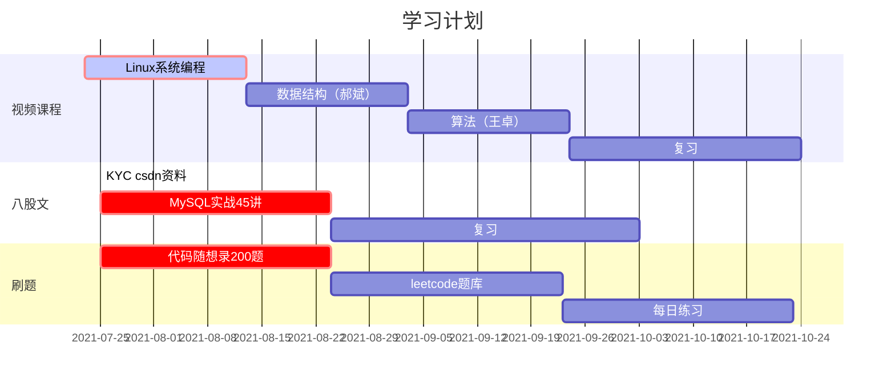
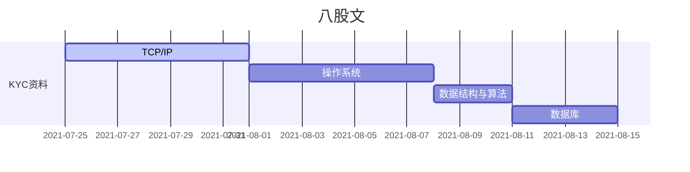
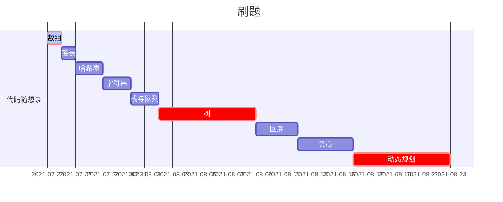

## 学习计划进度图

```mermaid
        gantt
        title 学习计划
        section 视频课程
        Linux系统编程          :crit, active,    a1, 2021-07-23,21d
        数据结构（郝斌）         :a2, after a1, 21d
        算法（王卓）            :a3, after a2, 21d
        复习                   :30d
        
        section 八股文
        KYC csdn资料           : crit, active, 2021-07-25,2021-08-15
        MySQL实战45讲          : crit, 30d
        复习                   :40d
        
        section 刷题
        代码随想录200题         :crit,  c1, 2021-07-25,30d
        leetcode题库          :after c1  , 30d
        每日练习               : 30d
```

```mermaid
        gantt
        title 八股文
        section KYC资料
        TCP/IP         :active,2021-07-25,7d
        操作系统         :7d
        数据结构与算法    :3d
        数据库          :4d
      
      

```

#### 视频课程计划

#### 八股文学习计划

#### 刷题计划（200题/月）

第一周：数组、链表、哈希表、字符串、栈与队列

第二周：二叉树

第三周：回溯、贪心

第四周：动态规划

* 看知识点，刷例题，看解析
* 刷leetcode题库，回顾知识点
* 每日练习

```mermaid
        gantt
        title 刷题
        section 代码随想录
        数组         :crit, active,  2021-07-25,1d
        链表         : 1d
        哈希表       :2d
        字符串       :2d
        栈与队列     :2d
        树          :crit,7d
        回溯         :3d
        贪心         :4d
        动态规划      :crit,7d


```

