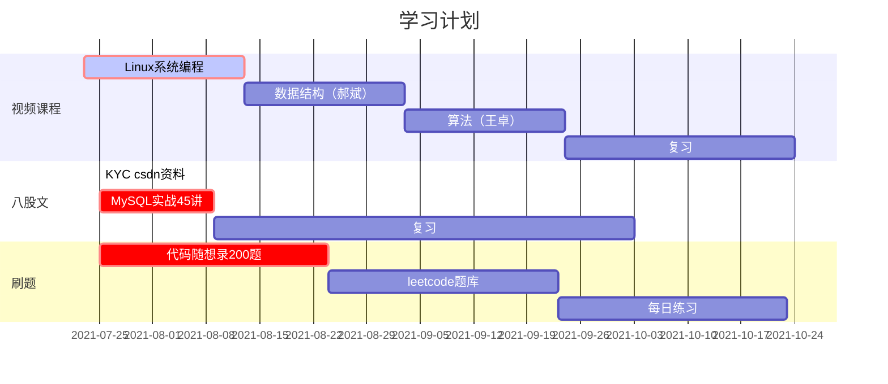

# LearningNotes

本仓库中的文章是学习相关书籍或文章的学习笔记

```mermaid
        gantt
        title 学习计划
        section 视频课程
        Linux系统编程          :crit, active,    a1, 2021-07-23,21d
        数据结构（郝斌）         :a2, after a1, 21d
        算法（王卓）            :a3, after a2, 21d
        复习                   :30d
        
        section 八股文
        KYC csdn资料           : crit, active, 2021-07-25,2021-08-15
        MySQL实战45讲          : crit, 15d
        复习                   :55d
        
        section 刷题
        代码随想录200题         :crit,  c1, 2021-07-25,30d
        leetcode题库          :after c1  , 30d
        每日练习               : 30d
```
